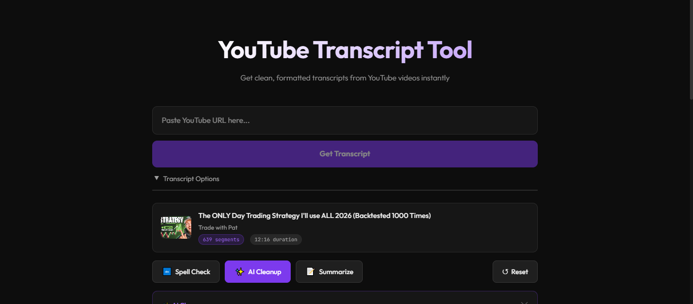

# YouTube Transcript Tool



A free web app that pulls clean, formatted transcripts from any YouTube video. Paste a link, hit the button, and get your transcript.

**Live:** [yt-script-cyan.vercel.app](https://yt-script-cyan.vercel.app)

## What it does

- Fetches transcripts from YouTube videos instantly
- Spell check, AI cleanup, and summarization
- View as segments (with timestamps) or plain text
- Export as plain text, markdown, or SRT
- Copy or download with one click
- Manual paste fallback if the auto-fetch doesn't work

## Tech

Next.js 16, TypeScript, Tailwind v4, Gemini + OpenAI APIs

## Run locally

```bash
npm install
```

Create a `.env.local` with your API keys:

```
YOUTUBE_TRANSCRIPT_API_KEY=your_key
GEMINI_API_KEY=your_key
OPENAI_API_KEY=your_key
```

```bash
npm run dev
```

Open [localhost:3000](http://localhost:3000).
